# Manual de Instalação — VPN Aggregator no Mini PC

Manual passo-a-passo para instalar o VPN Aggregator num mini PC com Ubuntu
Server 24.04 LTS.

> **Você está em modo TESTE.** As seções 1–5 cobrem o caminho de teste —
> **sem domínio próprio**, **sem licensing.vagg.io**, **sem TLS**, com
> imagens construídas localmente. Este caminho é o que faz sentido até
> você publicar `install.vagg.io` e o registry público das imagens.
>
> O caminho de produção (curl install.vagg.io | bash, TLS, license real)
> está descrito como referência em [docs/SPEC.md §9](SPEC.md#9-instalação-guia-para-it-da-consultoria).
>
> Os screenshots em `docs/manual-prints/` foram gerados pelo script
> `scripts/capture/capture.mjs` (Puppeteer) com fixtures determinísticas.

---

## 1. Pré-requisitos

### Hardware (mini PC)

| Recurso | Mínimo | Recomendado |
|---|---|---|
| CPU | 2 cores (x86_64) | 4 cores |
| RAM | 4 GB | 8 GB |
| Disco | 30 GB SSD | 100 GB SSD |
| Rede | 100 Mbps cabeada | 1 Gbps cabeada |

Modelos validados: Beelink SER-series (Ryzen 5/7), Minisforum UM-series,
Intel NUC i3/i5 11ª gen ou superior. Qualquer mini PC x86_64 com BIOS UEFI
moderno funciona.

### Software / rede (modo teste)

- Ubuntu Server 24.04 LTS (clean install) — ou Desktop, tanto faz
- Acesso SSH como conta sudo (ou monitor + teclado direto)
- IPv4 da LAN da consultoria (estático ou DHCP fixo) — o instalador
  usa `hostname -I` para descobrir
- Outbound liberado para:
  - `archive.ubuntu.com` (apt)
  - `download.docker.com` (instalar Docker)
  - `registry-1.docker.io` (pull do `coredns/coredns` e bases python/node/alpine)
  - GitHub (clone do repo)

> Em modo teste **não** precisamos de:
> - domínio próprio (`vpn.minhaempresa.com.br`) — usamos o IP da LAN
> - `licensing.vagg.io` — license check fica fail-soft
> - certificado TLS — painel é HTTP puro, só na rede interna
> - portas dos servidores VPN reais (a menos que você queira testar túneis
>   reais; pode rodar tudo sem nenhum cliente conectado)

---

## 2. Boot e instalação do Ubuntu Server

### 2.1 Criar pendrive bootável

1. Baixar a ISO em https://ubuntu.com/download/server
2. Gravar com Rufus (Windows) ou `dd` (Linux/macOS):
   ```bash
   sudo dd if=ubuntu-24.04.2-live-server-amd64.iso of=/dev/sdX bs=4M status=progress
   ```

_(print: tela do Rufus selecionando a ISO — capture na sua máquina)_

### 2.2 Instalação guiada

Conectar o mini PC com:
- Pendrive na USB
- Cabo de rede no switch
- Monitor + teclado USB para o setup inicial

Boot pelo pendrive (F12/Del/F10 dependendo do mini PC), opção `Try or
install Ubuntu Server`.

_(print: menu inicial do instalador Subiquity — capture na sua máquina)_

Configurações importantes:

| Tela | Valor |
|------|-------|
| Network configuration | Anote o IP que o DHCP atribuir (ou fixe estático) |
| Storage | Use entire disk + LVM (default OK) |
| Profile | usuário sudo, hostname `vagg-test` |
| SSH setup | habilitar OpenSSH server |
| Featured Server Snaps | **deixar tudo desmarcado** (Docker virá depois) |

_(print: tela "Install complete" pedindo reboot — capture na sua máquina)_

Após reboot, remova o pendrive. Anote o IP do mini PC — é o que você vai
usar pra acessar o painel.

---

## 3. Preparar a VM

Conecte por SSH:

```bash
ssh seu-usuario@<ip-do-mini-pc>
```

Atualize:

```bash
sudo apt update && sudo apt upgrade -y
sudo apt install -y git make
sudo timedatectl set-timezone America/Sao_Paulo
```

---

## 4. Clonar o repositório

```bash
cd ~
git clone https://github.com/rduarte6982/vagg.git
cd vagg
```

> Se o repo for privado, use `git clone git@github.com:rduarte6982/vagg.git`
> com chave SSH cadastrada, ou clone num PC com acesso e copie o tarball
> para o mini PC.

---

## 5. Rodar o instalador de teste

```bash
sudo bash scripts/test-install.sh
```

O script (5–15 minutos na primeira vez):

1. Instala Docker engine + compose plugin (skip se já presente)
2. Constrói as 8 imagens localmente via `make images-build`:
   - `ghcr.io/rduarte6982/vagg/core:test`
   - `ghcr.io/rduarte6982/vagg/ui:test`
   - `ghcr.io/rduarte6982/vagg/portal:test`
   - `ghcr.io/rduarte6982/vagg/tunnel-{openvpn,openconnect,openfortivpn,wireguard,strongswan}:test`
3. Cria diretórios em `/var/lib/vagg/*` e `/etc/vagg/`
4. Gera secrets de teste (JWT 256-bit, senha admin Argon2id)
5. Roda `alembic upgrade head` num container temporário
6. `docker compose up -d` com `installer/compose/docker-compose.test.yml`
7. Health-check 30 × 2s

Final esperado:

```
[test-install] ============================================================
[test-install] Instalação de TESTE concluída.
[test-install]
[test-install] Painel admin    : http://192.168.0.42:8443
[test-install] Portal auditor  : http://192.168.0.42:8444
[test-install] Login           : admin@vagg.test
[test-install] Senha           : cat /etc/vagg/admin-credentials.txt
[test-install] ============================================================
```

A senha temporária está em `/etc/vagg/admin-credentials.txt` (mode 0600).

### Resetar para re-testar

```bash
sudo bash scripts/test-install.sh --reset
```

Apaga `/var/lib/vagg`, `/etc/vagg`, derruba os containers, e roda do zero.

---

## 6. Primeiro acesso ao painel

Abra `http://<ip-do-mini-pc>:8080` no navegador (a UI é servida na 8080
em modo teste — em produção ela substitui o 443).

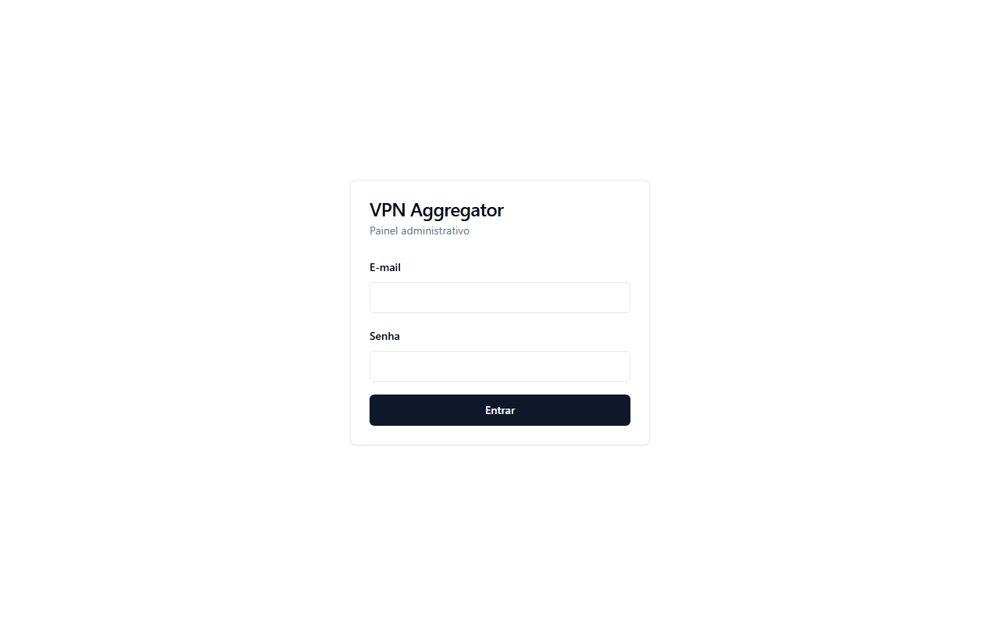

Logar com `admin@vagg.test` (ou o que você passou em `--admin-email`)
+ senha do `admin-credentials.txt`.

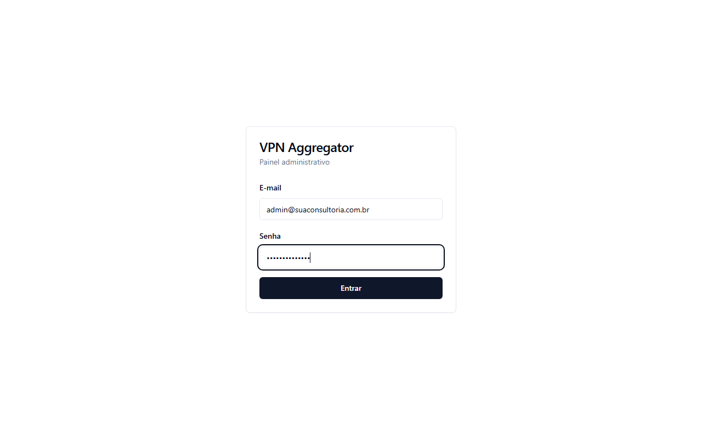

> Ao logar, o navegador vai reclamar do TLS porque é HTTP puro. **Aceite
> em modo teste**; em produção um TLS terminator (Caddy/nginx-proxy/
> Cloudflare) fica na frente do compose.

Após o login você cai no dashboard. Numa instalação fresca os contadores
ficam zerados:

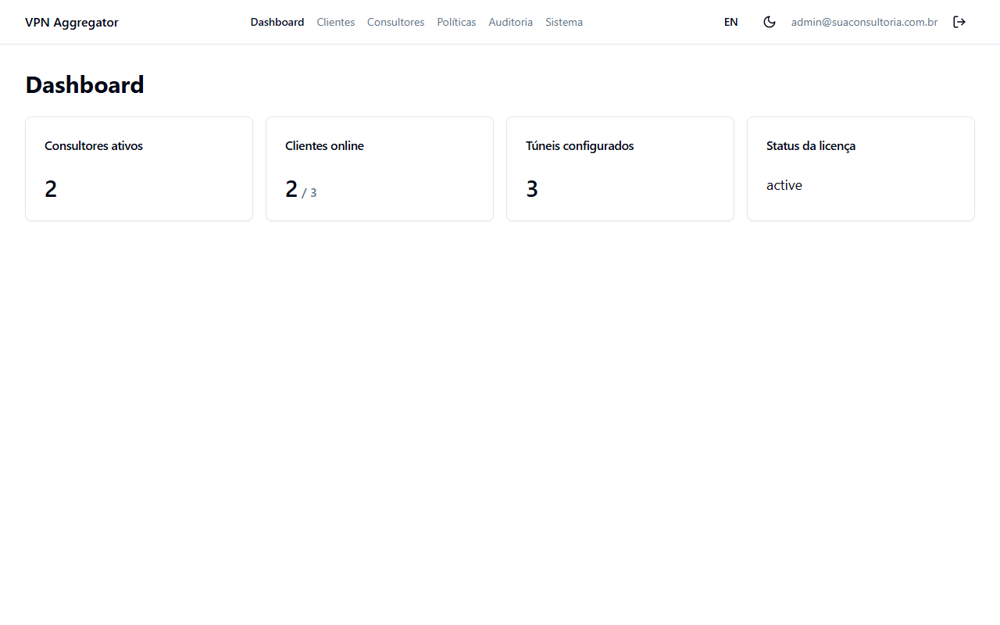

> O screenshot acima mostra o estado **depois** de cadastrar 3 clientes
> e 2 consultores. Numa instalação nova os 4 cards mostram 0/0.

Idioma alterna no canto superior direito (PT/EN), tema dark/light no
ícone ☼/☾ ao lado.

---

## 7. Adicionar o primeiro cliente

> **Em modo teste, túneis reais não funcionam plenamente** — o
> `vagg-core` não roda em `network_mode: host` para preservar o
> ambiente de testes do Docker Desktop / mini PC. Os campos abaixo são
> aceitos, o container do túnel sobe, mas a rota até a rede do cliente
> exige a configuração de produção.
>
> Para validar o fluxo de UI / RBAC / audit / portal, qualquer dado
> sintético serve.

Menu **Clientes → + Novo cliente**.

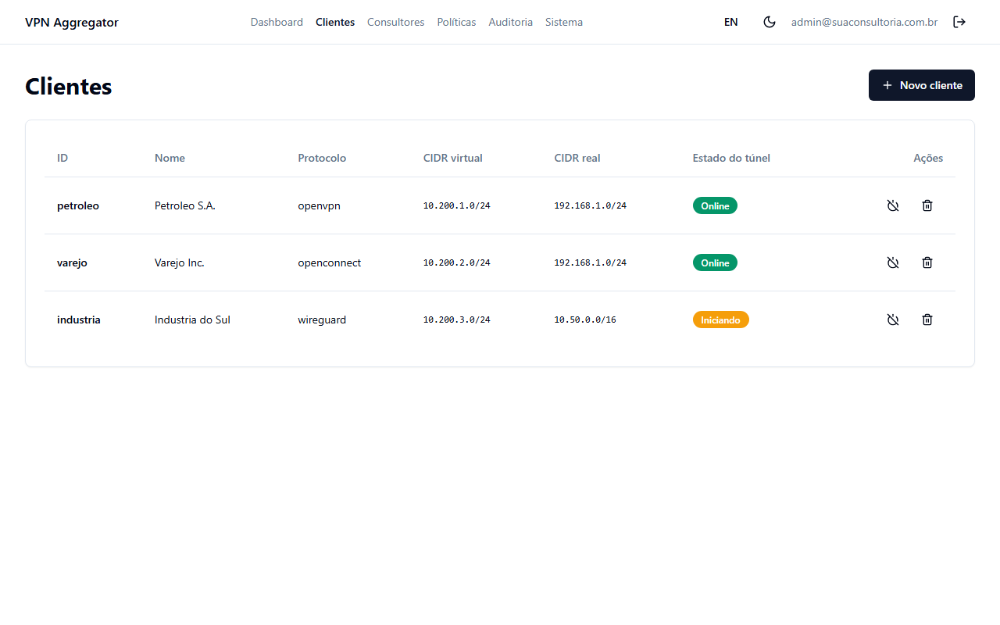

Preencher:

| Campo | Valor de teste |
|-------|-------|
| ID (slug) | `petroleo` |
| Nome | `Petroleo S.A.` |
| Protocolo | `openvpn` |
| Virtual CIDR | `10.200.1.0/24` |
| Real CIDR | `192.168.1.0/24` |
| DNS server | `192.168.1.10` |
| Username | `qualquer-coisa` (vai falhar autenticação, mas o registro fica) |
| Password | `qualquer-coisa` |
| Configuração do túnel | qualquer texto (use um `.ovpn` real se quiser) |

Salvar → o vagg-core cria o registro, sobe o container `vagg-tunnel-petroleo`,
e em modo teste ele provavelmente vai pra `errored`. Em **Clientes →
Petróleo → Logs** você vê a saída do tunnel-controller.

---

## 8. Adicionar consultores e policies

### 8.1 Consultores

**Consultores → + Novo consultor**:

| Campo | Como preencher (teste) |
|-------|-------|
| Email | qualquer email |
| Nome | display |
| OpenVPN username | qualquer string (em produção: o do client-config-dir) |
| Static pool IP | qualquer IP (em produção: IP fixo no pool da OpenVPN) |
| Role | `viewer` / `operator` / `admin` |

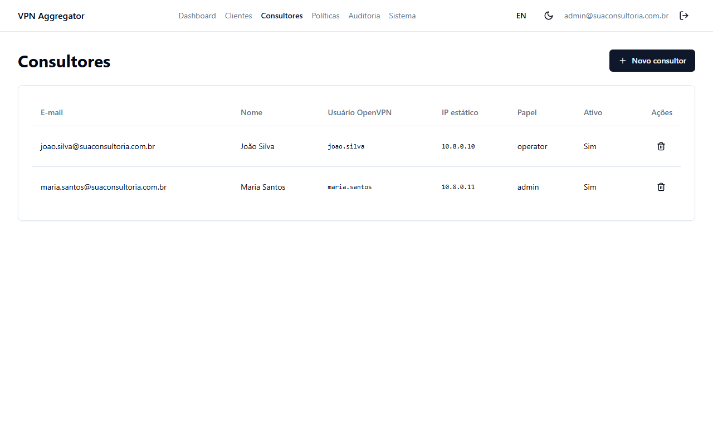

### 8.2 Policies

**Políticas → + Nova política**:

- Consultor: João Silva
- Cliente: Petróleo
- Escopo: `full` ou `subnet:10.200.1.128/26` ou `host:10.200.1.50`

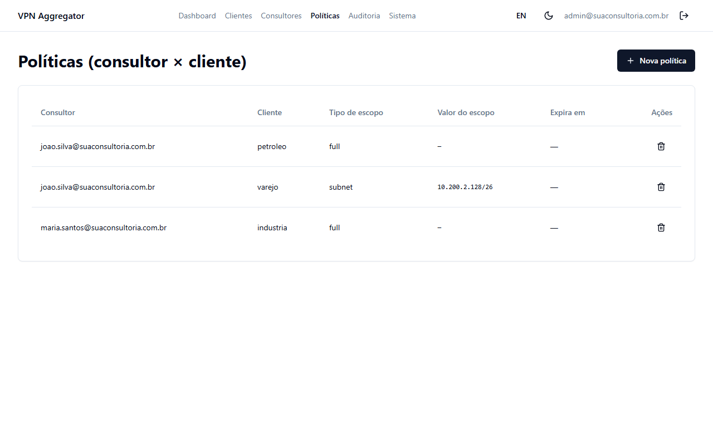

Em modo teste o iptables não está sendo aplicado no host
(`network_apply_enabled=false`), mas a tabela `policies` é gravada
normalmente — quando migrar pra produção o `network_manager.rebuild()`
vai materializar tudo de uma vez.

---

## 9. MFA / OTP (skip em teste)

OTP só faz sentido em túneis reais conectados a clientes que pedem 2FA.
Em modo teste pode ignorar.

A interface continua funcional — **Clientes → cliente-X → Enviar OTP**
escreve no FIFO interno do container, mas como o tunnel-controller não
está em estado válido, não fará nada.

---

## 10. Auditoria

Todas as ações do admin (criar/atualizar/deletar cliente, consultor,
policy, viewer) viram eventos `*.created` / `*.deleted` na auditoria,
encadeados por hash SHA-256.

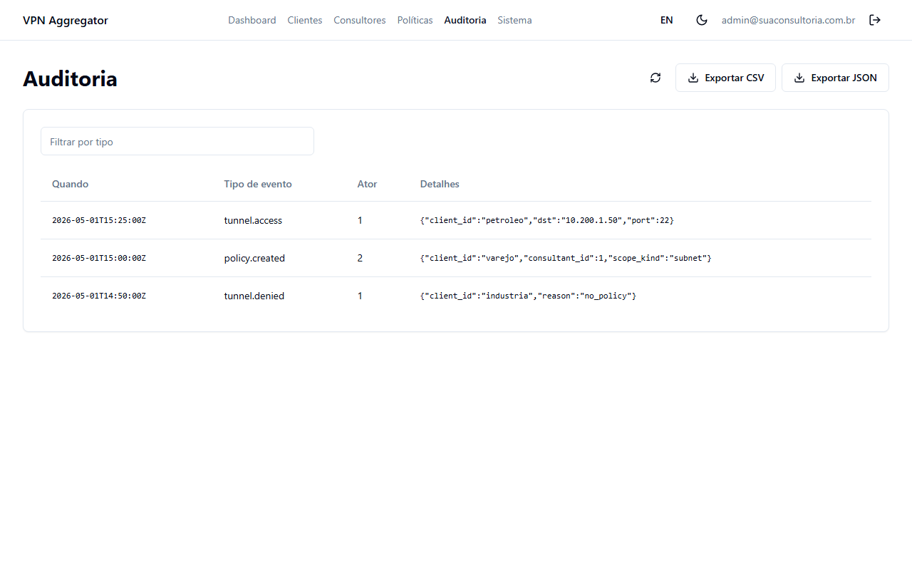

Botão **Exportar CSV** / **Exportar JSON** baixa os eventos filtrados.
Para auditorias em larga escala, o endpoint `GET /api/v1/audit/export.ndjson`
faz streaming line-by-line.

Verificar a integridade da chain (depois de exportar `audit.ndjson` via UI):

```bash
docker exec -i vagg-test-vagg-core-1 \
    python -m vagg_core.scripts.verify_audit /dev/stdin < audit.ndjson
```

Saída esperada: `OK — N events, chain intact`.

---

## 11. Sistema

A tela **Sistema** mostra versão, saúde, status de licença (em modo
teste fica `unknown` — license-server stub) e tem o botão de regenerar
o Corefile do `vagg-dns`:

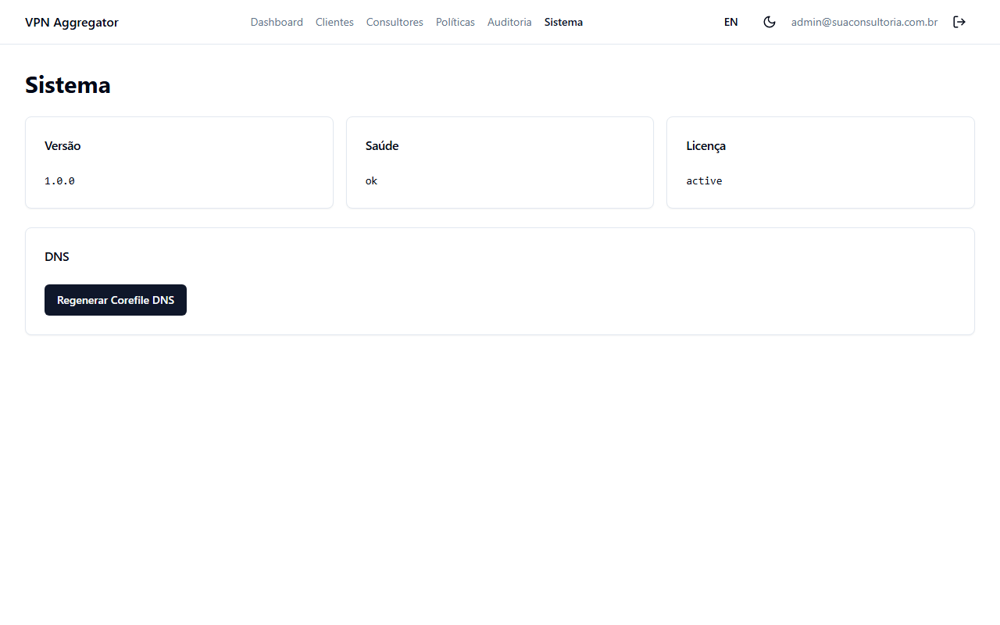

Clicar em "Regenerar DNS Corefile" lê todos os clientes ativos do banco,
renderiza o `Corefile`, e envia SIGUSR1 ao container `vagg-dns`.

---

## 12. Portal de Transparência (modo teste)

Adicionar um auditor via API:

```bash
TOKEN=$(curl -fsS -X POST http://<ip-do-mini-pc>:8443/api/v1/auth/login \
    -H 'Content-Type: application/x-www-form-urlencoded' \
    -d "username=admin@vagg.test&password=$(sudo grep Senha /etc/vagg/admin-credentials.txt | awk '{print $3}')" \
    | python3 -c "import sys,json; print(json.load(sys.stdin)['access_token'])")

curl -fsSL -X POST http://<ip-do-mini-pc>:8443/api/v1/external-viewers \
    -H "Authorization: Bearer $TOKEN" \
    -H "Content-Type: application/json" \
    -d '{
          "client_id": "petroleo",
          "email": "auditor@petroleo.test",
          "display_name": "Maria Compliance",
          "role": "compliance",
          "enable_totp": true
        }'
```

A resposta inclui `totp_uri` — abra-o como QR code e leia no Google
Authenticator:

```bash
sudo apt install -y qrencode
qrencode -t ansiutf8 "$(echo "<totp_uri-da-resposta>")"
```

Acesse `http://<ip-do-mini-pc>:8081`:

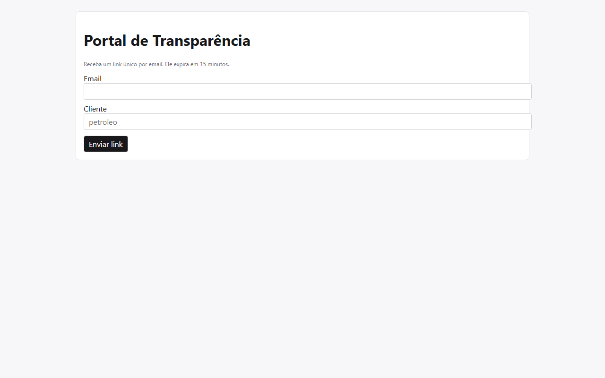

Email do auditor + cliente:

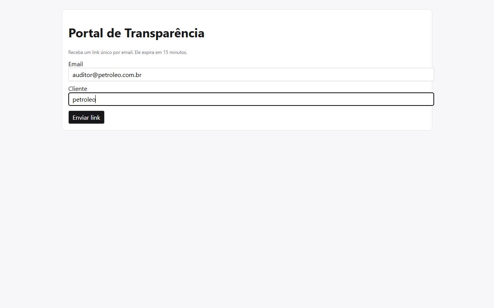

Como em modo teste não há SMTP configurado, o token cru aparece no log:

```bash
docker logs vagg-test-vagg-core-1 2>&1 | grep portal.magic_link.issued
```

A linha tem `raw_token_hint=ABC123` — o token completo é o token cru
gerado, exposto via log de DEBUG. Em produção o token vai por email
automaticamente.

Após o consume + TOTP (se habilitado):

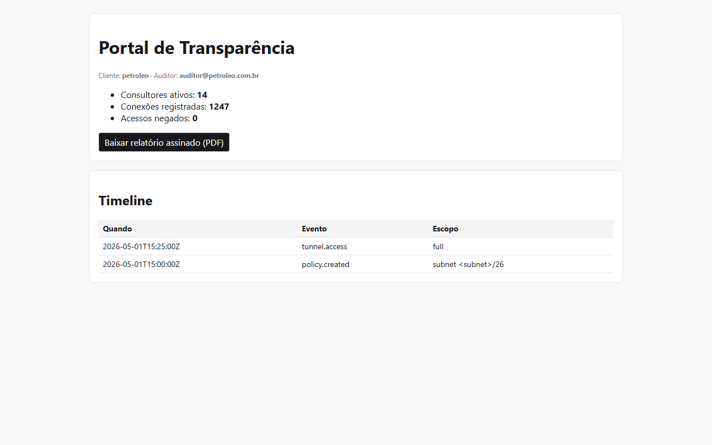

---

## 13. Logs e troubleshooting

```bash
# Stack inteira
docker compose -f /etc/vagg/docker-compose.yml logs -f

# Por serviço (o nome do projeto compose é "vagg-test")
docker logs -f vagg-test-vagg-core-1
docker logs -f vagg-test-vagg-ui-1
docker logs -f vagg-test-vagg-portal-1

# Um túnel específico (criado pelo orchestrator, fora do compose)
docker logs -f vagg-tunnel-petroleo
```

| Sintoma | Causa | Resolução |
|---------|-------|-----------|
| `make images-build` falha | Dockerfile com erro / sem internet | Rode `docker build` direto pra ver o stack trace completo |
| `vagg-core` em restart loop | core.env malformado | `cat /etc/vagg/core.env`; refaça com `--reset` |
| Painel acessível só de localhost | UFW bloqueando | `sudo ufw allow 8080,8443,8081/tcp` |
| `permission denied` em `/var/run/docker.sock` | usuário sem grupo docker | `sudo usermod -aG docker $USER && newgrp docker` |
| Túnel up mas DNS não resolve | Em teste isso é esperado (vagg-dns roda em :5353 só localhost) | Em produção a porta 53 fica no host |
| Porta 8443 já em uso | Outro serviço local | Mude o port mapping em `docker-compose.test.yml` |

---

## 14. Migrar de teste para produção

Quando você publicar `install.vagg.io` + registry de imagens + license-server:

```bash
curl -fsSL https://install.vagg.io/install.sh | sudo bash -s -- \
    --license-key=VAGG-XXXX-XXXX-XXXX \
    --domain=vpn.suaconsultoria.com.br \
    --admin-email=ti@suaconsultoria.com.br
```

A diferença em relação ao test-install:
- imagens vêm do registry (`docker pull` em vez de `make images-build`)
- `network_apply_enabled=true` (iptables/ip-route ativos no host)
- `network_mode: host` (necessário pro NETMAP funcionar)
- TLS terminator (Caddy/nginx) na frente, com cert Let's Encrypt
- `vagg-update.timer` habilitado (consulta `updates.vagg.io/manifest.json`)
- license-server real consultado diariamente

Os dados gerados em modo teste **não migram automaticamente**. Para
preservar:

```bash
sudo cp /var/lib/vagg/db/vagg-core.db ~/vagg-test-snapshot.db
# Em produção, restaurar copiando dentro do container vagg-core.
```

---

## 15. Desinstalar (modo teste)

```bash
sudo bash scripts/test-install.sh --reset
sudo rm -rf /var/lib/vagg /etc/vagg
docker images "ghcr.io/rduarte6982/vagg/*" -q | xargs -r docker rmi
```

---

## Apêndice — Diagrama de rede (modo teste)

```
┌─────────────────────────────────────────────────────────────┐
│ Notebook na LAN                                             │
│   ↓ http://<ip-mini-pc>:8080  (vagg-ui)                     │
│   ↓ http://<ip-mini-pc>:8081  (vagg-portal)                 │
│   ↓ http://<ip-mini-pc>:8443  (vagg-core API)               │
└──────────┬──────────────────────────────────────────────────┘
           │
┌──────────┴──────────────────────────────────────────────────┐
│ Mini PC (vagg-test)                                         │
│  ┌────────────────────────────────────────────────────────┐ │
│  │ docker compose:                                        │ │
│  │   vagg-core (FastAPI :8443)                            │ │
│  │   vagg-ui (nginx :80→host:8080)                        │ │
│  │   vagg-portal (nginx :80→host:8081)                    │ │
│  │   vagg-dns (CoreDNS, só :5353 localhost — teste)       │ │
│  └────────────────────────────────────────────────────────┘ │
│  Sem iptables NETMAP, sem RBAC chain ativos no host         │
└─────────────────────────────────────────────────────────────┘
```

Em produção a topologia muda para a do [SPEC.md §3.1](SPEC.md#31-diagrama-lógico):
container `vagg-core` em `network_mode: host`, iptables/ip-route ativos,
DNS na porta 53 do host, tunnel containers criando interfaces `tun-*`
diretamente no host network namespace.
