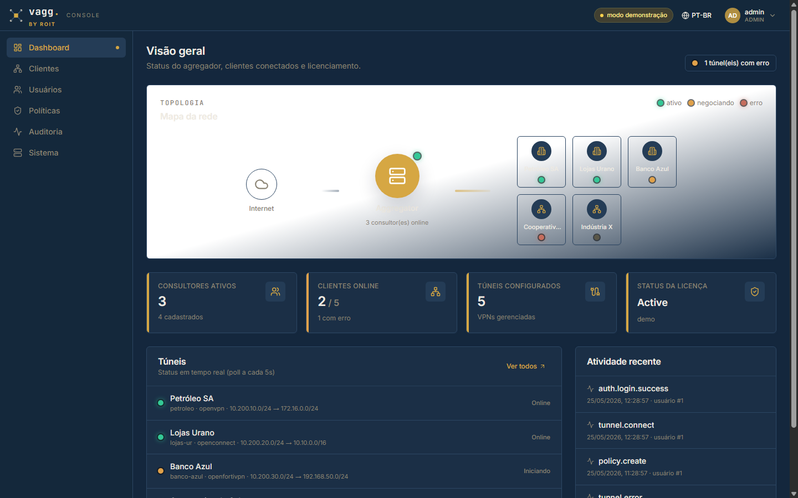
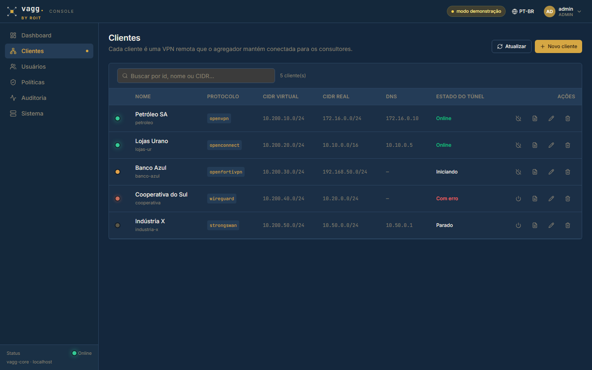
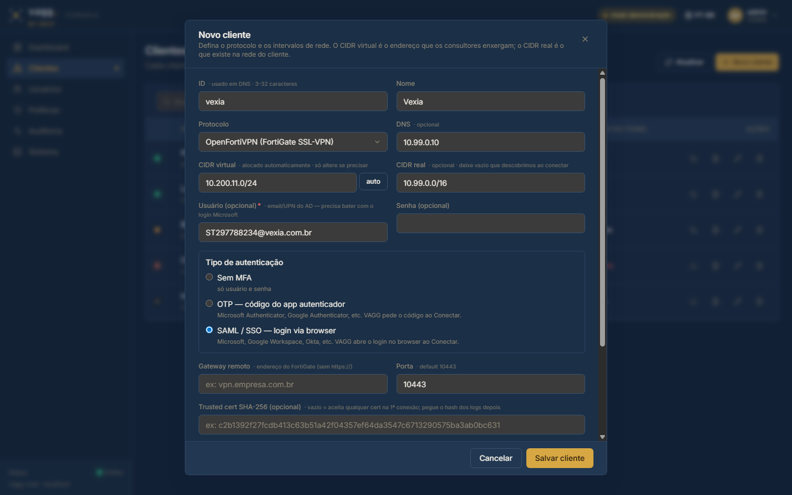
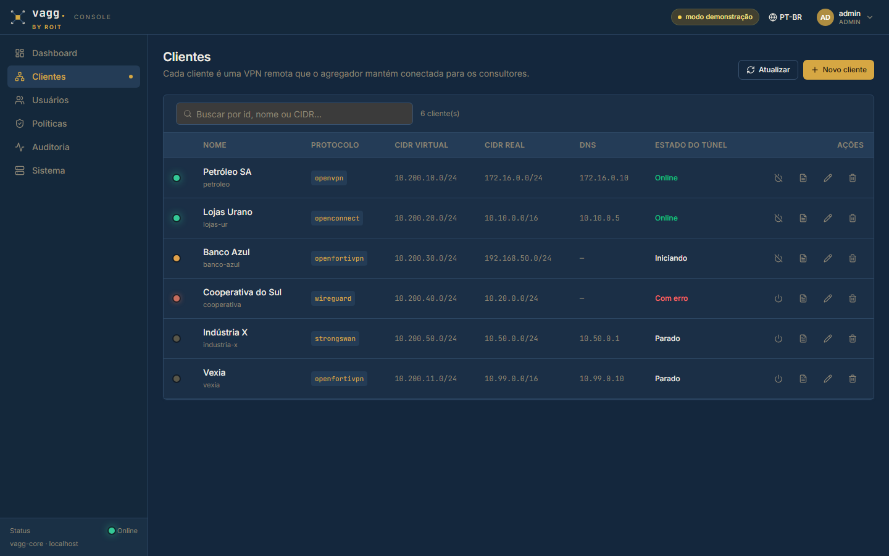
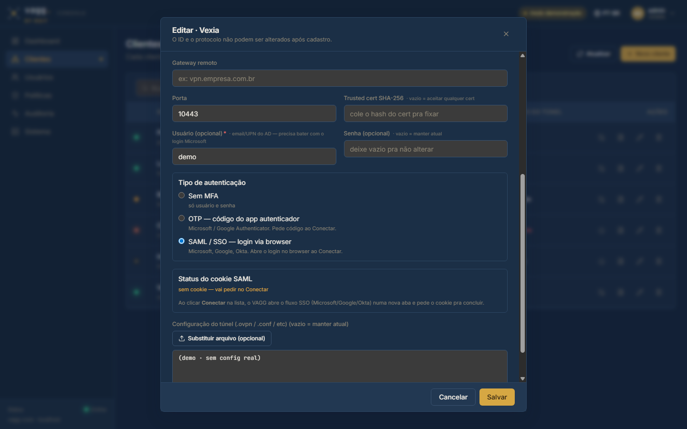
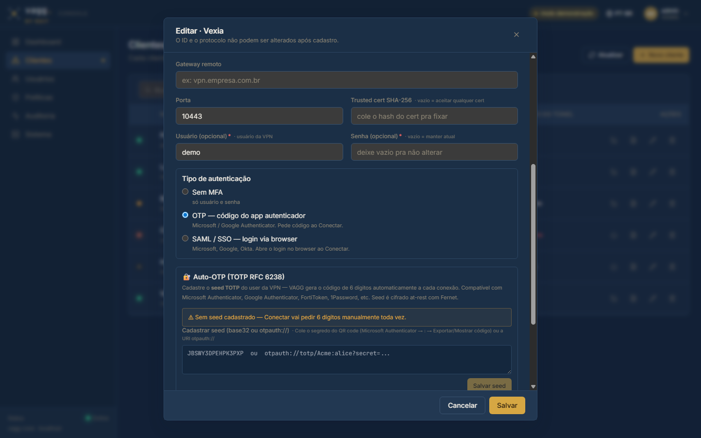
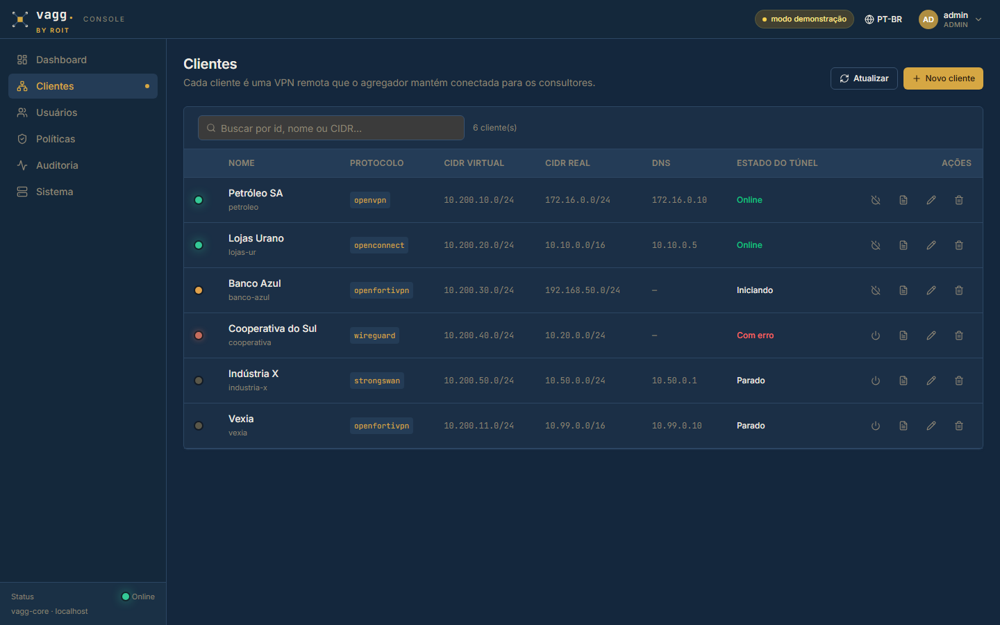
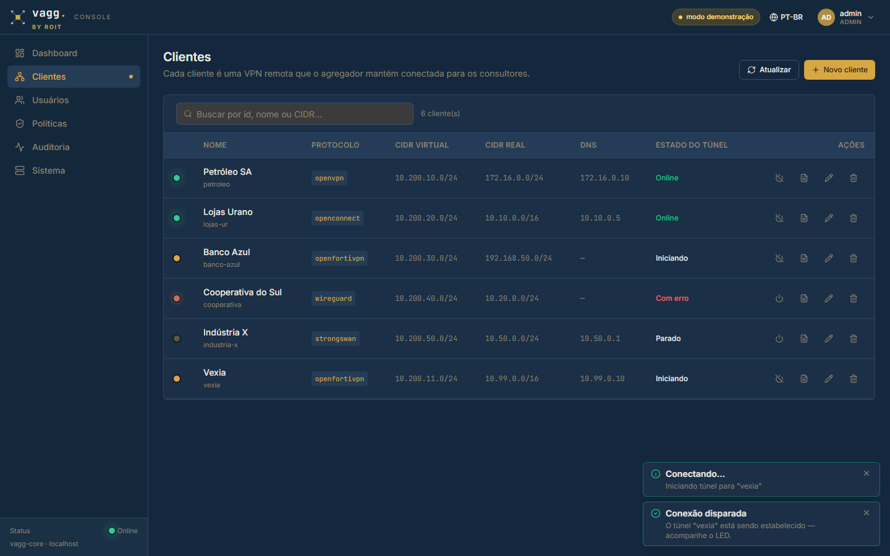
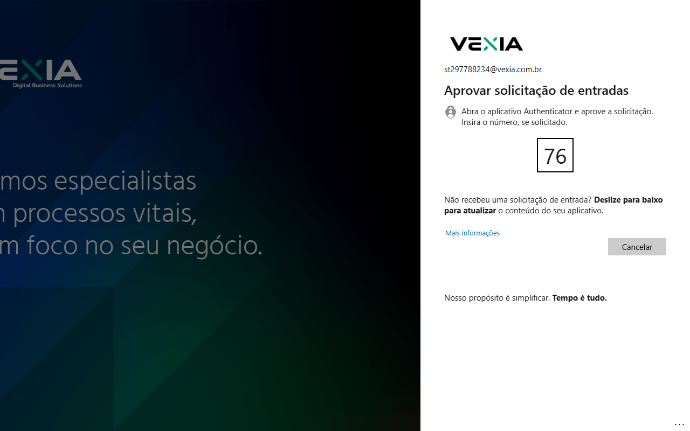
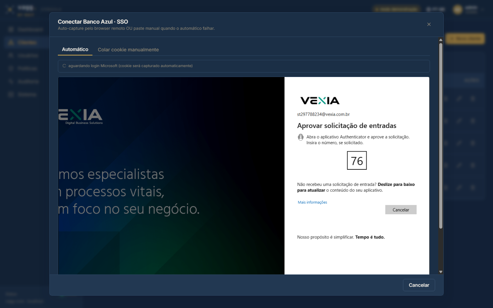

# Fluxo SAML + Auto-OTP no painel VAGG

Screenshots capturados em 2026-05-25 do painel admin (modo demo) mostrando o passo-a-passo
pra cadastrar um cliente VPN com SAML (FortiGate + Azure AD), Auto-OTP (TOTP RFC 6238),
e conectar.

> **Genericidade:** os fluxos abaixo funcionam pra **qualquer** cliente — não há
> nada hardcoded para Vexia. O cadastro só pede host/porta/credenciais e o método
> de auth. Vexia foi usada como exemplo de validação real do bypass do 403 hostcheck
> (ver `MANUAL.md §11.1.1` e `memory/reference_vexia_saml.md`).

## Passo a passo

### 1. Dashboard inicial



Visão geral — mapa de topologia, stat tiles, lista de túneis em tempo real
e atividade recente da auditoria.

### 2. Lista de clientes



Página `Clientes` — tabela com tipo, CIDR virtual/real, DNS, status do túnel
e ações (conectar, logs, editar, excluir). Botão **Novo cliente** no topo.

### 3. Cadastrar cliente (FortiGate + SAML)



Modal **Novo cliente** preenchido pra um gateway FortiGate com SSO Azure AD.
Campos importantes:

- **Protocolo:** `openfortivpn`
- **Usuário:** UPN do Azure AD (ex: `usuario@dominio.com.br`) — necessário pra
  amarrar a sessão SAML
- **Tipo de autenticação:** ▣ SAML / SSO — login via browser
  (alternativas: Sem MFA, OTP código do app autenticador)
- **Gateway remoto / Porta:** host:porta do FortiGate (preenchidos abaixo do form)

### 4. Cliente cadastrado na lista



Cliente `vexia` aparece na lista com status `Parado` (cinza). Próximo passo é
conectar — ao clicar no ícone ⏻, o VAGG abre o saml-portal num iframe pra
o usuário completar o login Microsoft.

### 5. Edição — auth = SAML



Modal de edição com `Tipo de autenticação` = **SAML / SSO** selecionado. Logo
abaixo aparece o card **Status do cookie SAML**:

> *sem cookie — vai pedir no Conectar*
> *Ao clicar Conectar na lista, o VAGG abre o fluxo SSO (Microsoft/Google/Okta)
> numa nova aba e pede o cookie pra concluir.*

Quando o usuário completar o login no iframe (e o callback automático bypass do
403 capturar o `SVPNCOOKIE` — ver `reference_vexia_saml.md`), esse painel
mostra `✓ cookie SAML válido até <data>`.

### 6. Edição — auth = OTP com card Auto-OTP



Trocando o tipo de autenticação pra `OTP`, aparece o card **🔐 Auto-OTP (TOTP RFC 6238)**:

> Cadastre o **seed TOTP** do user da VPN — VAGG gera o código de 6 dígitos
> automaticamente a cada conexão. Compatível com Microsoft Authenticator,
> Google Authenticator, FortiToken, 1Password, etc. Seed é cifrado at-rest com Fernet.

Estado inicial: `⚠ Sem seed cadastrado — Conectar vai pedir 6 dígitos manualmente toda vez.`

Cola-se o seed (formato `JBSWY3DPEHPK3PXP` ou URI `otpauth://totp/...`) e clica
**Salvar seed**. Depois disso, a lista mostra badge **🔐 Auto-OTP** e o Conectar
fica zero-touch (sem prompt).

### 7. Lista com badges



A lista de clientes mostra badges coloridos por método de autenticação:

- **🔐 Auto-OTP** (verde) — TOTP cadastrado, conexão automática
- **OTP manual** (âmbar) — auth_method=otp mas sem seed (admin digita)
- **SAML** (roxo) — auth via browser SSO

### 8. Conectar — ação disparada



### 9. Tela do push number (Microsoft Authenticator)



Captura **real** durante o login SAML contra o gateway `vpnssl.vexia.com.br`
(branded com identidade da Vexia "Digital Business Solutions"). Após digitar
o email + senha, o Azure AD pede pro user **abrir o Microsoft Authenticator no
celular e digitar o número exibido** — neste caso `76`. Quando o user aprova
no celular, o flow segue: o gateway emite o session id, o callback local em
`127.0.0.1:8020` faz o exchange via `/remote/saml/auth_id`, captura SVPNCOOKIE
e o túnel sobe — **sem 403 hostcheck e sem prompt extra pro user.**

Este é o ÚNICO ponto de interação humana no fluxo SAML completo (e é
obrigatório pelo Azure AD — não pode ser automatizado).

### 10. Modal SAML do VAGG — como o admin vê



Composição realista do **exato modal que o admin VAGG enxerga** ao clicar
Conectar num cliente com `auth_method=saml`:

- **Título do modal:** "Conectar Banco Azul · SSO"
- **Descrição:** "Auto-capture pelo browser remoto OU paste manual quando o automático falhar"
- **Tabs:** `Automático` (default) e `Colar cookie manualmente` (fallback)
- **Status bar:** "aguardando login Microsoft (cookie será capturado automaticamente)" com spinner
- **Iframe central:** carrega o noVNC do container `vagg-saml-portal`
  (porta 14500 do servidor), mostrando o Firefox remoto na tela do gateway
  Vexia com o prompt do Microsoft Authenticator
- **Footer:** botão Cancelar

O admin **digita email + senha dentro do iframe** (keystrokes vão pro Firefox
remoto via WebSocket noVNC), **aprova o push no celular** com o número exibido
(`76` neste exemplo), e **espera** — o status muda automaticamente pra
`✓ cookie capturado — túnel iniciando` quando o callback `127.0.0.1:8020`
intercepta o redirect e grava o SVPNCOOKIE. Modal fecha sozinho.

Nenhum dado sensível passa pelo PC do admin: senha vai direto pro Microsoft
via Firefox remoto, e o cookie capturado fica no servidor.

Clicando ⏻ na linha do cliente:

- **Sem MFA:** dispara o `connect` direto, túnel sobe.
- **OTP manual:** abre modal pedindo o código de 6 dígitos.
- **Auto-OTP:** dispara `connect` e mostra toast "Conectando com Auto-OTP — VAGG vai
  gerar o código TOTP automaticamente — sem ação necessária".
- **SAML:** abre o saml-portal num iframe pra completar o login Microsoft.
  Após captura do cookie (via `?redirect=1` + endpoint local `127.0.0.1:8020`
  — bypass do 403 hostcheck), o túnel sobe.

---

## Componentes verificados nestas telas

- **Cards de método de auth** (`Sem MFA` / `OTP` / `SAML`) — radio único, fonte
  da verdade pro `auth_method` do cliente.
- **Status do cookie SAML** — mostra validade do cookie capturado pelo saml-portal.
- **Card Auto-OTP (TOTP RFC 6238)** — adicionado nesta versão pra zero-touch TOTP.
- **Badges na lista** — feedback visual rápido por cliente.

## Como reproduzir

```bash
cd ui/
npm install
npm run dev   # http://localhost:5173/?demo=1
```

Modo demo simula clientes/consultores/políticas em memória — sem precisar de
backend. Pra validar o fluxo SAML real (bypass do 403) precisa do homelab
com a stack `vagg/saml-portal:test` recém-buildada (ver
`memory/reference_vexia_saml.md` plano de re-test).
